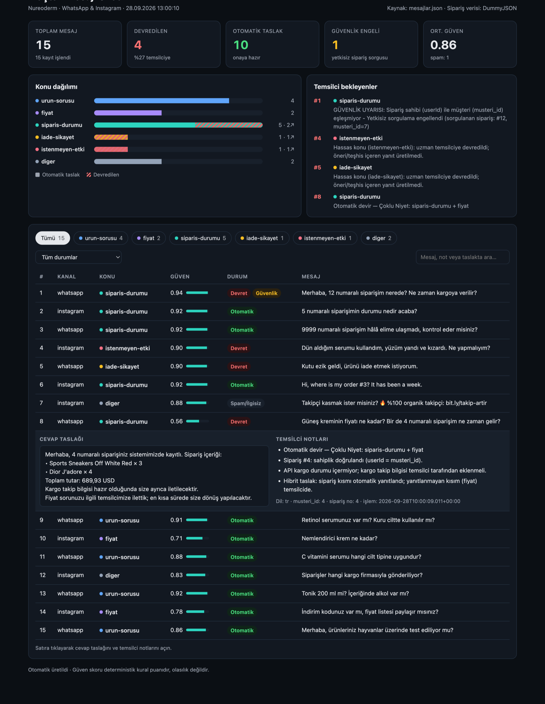
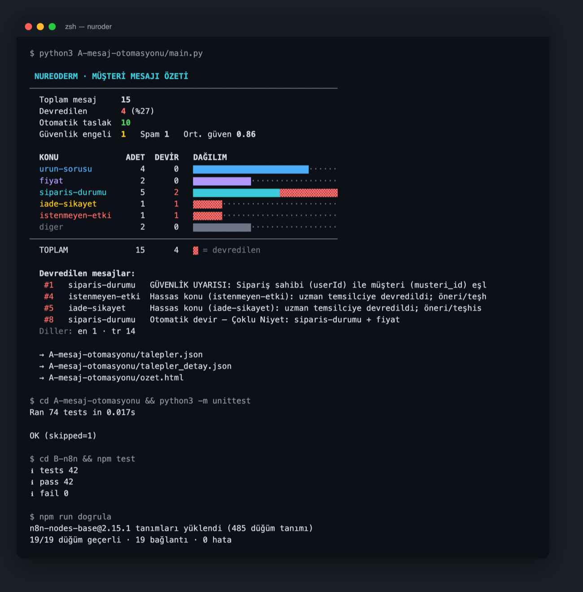

# Nureoderm — AI Otomasyon / Entegrasyon Görevi

İki bölüm:
- **A:** Kozmetik e-ticaret müşteri mesajlarını sınıflandırıp temsilciye iş listesi çıkaran Python aracı.
- **B:** Laptop fiyat takibi için n8n akışı.

Tüm iş Claude Code ile yapıldı; promptlar `promptlar/` altında sırasıyla ve olduğu gibi duruyor.

<p align="center">
  
  <br><sub><b>Bölüm A — <code>ozet.html</code>.</b> 15 mesaj, 4 devir. Mesaj 8 açık: sahipliği doğrulanan sipariş bilgisi taslakta, fiyat sorusu temsilcide (hibrit taslak).</sub>
</p>

<p align="center">
  
  <br><sub><b>Terminal.</b> <code>main.py</code> ANSI özeti · A: 74 test · B: 42 test · <code>workflow.json</code> n8n düğüm tanımlarına karşı 19/19 geçerli. Gerçek komut çıktılarından üretildi.</sub>
</p>

## Zaman

| | |
|---|---|
| Görev süresi | E-postanın alınmasından itibaren 3 saat |
| Claude Code oturumu başlangıcı | **28.09.2026 11:59** (UTC+3), oturum kaydındaki ilk mesaj |
| Son teslim commit'i | **28.09.2026 13:04** (UTC+3) |

Saatler oturum kaydından (`promptlar/ham-oturum-logu.md`) alındı. E-postanın alındığı saat bu kayıtta yok.

## Hızlı başlangıç

Gereksinim: **Python 3.9+** (yalnızca standart kütüphane) ve **Node.js 18+** (bağımlılık yok). `pip install` / `npm install` gerekmez.

```bash
# Bölüm A — 15 mesajı işle (DummyJSON'a canlı istek atar)
python3 A-mesaj-otomasyonu/main.py            # talepler.json, talepler_detay.json, ozet.html + terminal özeti
python3 A-mesaj-otomasyonu/main.py --detay    # her mesaj için kurallar, notlar ve taslaklar

# Bölüm A — testler (ağa çıkmaz)
cd A-mesaj-otomasyonu && python3 -m unittest -v      # ya da: python3 -m pytest -q
CANLI_TEST=1 python3 -m unittest tests.test_api      # + gerçek DummyJSON'a karşı canlı test

# Bölüm B — n8n akışı testleri ve canlı simülasyon
cd B-n8n && npm test          # 42 test (ilk çalıştırmada n8n düğüm tanımları indirilir, ~9 MB)
npm run dogrula               # workflow.json → n8n-nodes-base@2.15.1 tanımlarına karşı şema doğrulaması
npm run canli                 # gerçek siteyi 20 sayfa gezen uçtan uca simülasyon
npm run olustur               # kod/*.js → workflow.json (Code düğümlerini değiştirdikten sonra)
```

**Özet sayfası:** `A-mesaj-otomasyonu/ozet.html` tek dosyadır, dış bağımlılığı yoktur. Tarayıcıda
doğrudan açılır (`open A-mesaj-otomasyonu/ozet.html`), sunucu gerekmez. Sayfada 5 istatistik kartı,
konu dağılımı, temsilci bekleyenler listesi ve konu/durum/metin filtreli tablo var; satıra tıklayınca
cevap taslağı ve notlar açılır.

## Proje yapısı

```
├── A-mesaj-otomasyonu/
│   ├── main.py                    giriş noktası: işle → 3 çıktı dosyası + terminal özeti
│   ├── mesajlar.json              verilen 15 mesaj (değiştirilmedi)
│   ├── talepler.json              ZORUNLU çıktı: { id, konu, devret, cevap_taslagi, not }
│   ├── talepler_detay.json        ek: güven, dil, eşleşen kurallar, işlem zamanı
│   ├── ozet.html                  tek sayfalık dashboard
│   ├── otomasyon/
│   │   ├── metin.py               Türkçe normalizasyon, sipariş no ayıklama, dil algılama
│   │   ├── siniflandirici.py      ağırlıklı kural motoru + deterministik güven skoru
│   │   ├── isleyici.py            politika katmanı: devir kuralları, IDOR kontrolü, politika denetimi
│   │   ├── api.py                 DummyJSON sepet istemcisi + sahiplik doğrulaması
│   │   ├── urun_arama.py          bonus: ürün arama + alaka filtresi
│   │   ├── sablonlar.py           müşteriye giden tüm metinler (TR/EN)
│   │   └── ozet.py                ANSI terminal özeti + HTML dashboard
│   └── tests/                     74 test (unittest)
├── B-n8n/
│   ├── workflow.json              n8n'e import edilebilir akış (19 düğüm)
│   ├── akis-aciklama.md           adım adım akış · başlangıç şablonu · değişiklikler
│   ├── kod/                       Code düğümlerinin kaynağı (workflow.json'a gömülür)
│   ├── araclar/olustur.js         workflow.json üreticisi
│   ├── araclar/sema-dogrula.js    n8n kurmadan, gerçek düğüm tanımlarına karşı şema doğrulaması
│   └── test/                      42 test + canlı simülasyon + gerçek site HTML fixture'ları
├── docs/                          README görselleri (dashboard, terminal)
└── promptlar/
    ├── A-claude-code.md           A bölümü promptları + her adımda yapılanlar
    ├── B-n8n.md                   B bölümü promptları + mimari kararlar
    ├── ham-oturum-logu.md         oturumun ham kaydı (tüm mesajlar, araç çağrıları)
    └── oturum_logu_cikar.py       ham logu üreten betik
```

## Bölüm A — Müşteri mesajı otomasyonu

**Akış:** mesaj → normalizasyon → kural motoru (konu + güven skoru) → politika katmanı (devir kararı,
sipariş sorgusu, ürün arama, taslak) → politika denetimi → `talepler.json` + özet.

**Sonuç (15 mesaj):**

| Konu | Mesajlar | Devir |
|---|---|---|
| siparis-durumu | 1, 2, 3, 6, 8 | 1 (güvenlik), 8 (çoklu niyet) |
| urun-sorusu | 9, 11, 13, 15 | — |
| fiyat | 10, 14 | — |
| diger | 7 (spam), 12 | — |
| iade-sikayet | 5 | 5 |
| istenmeyen-etki | 4 | 4 |

**Toplam:** 4 devir, 10 otomatik taslak, 1 spam (yanıtsız).

- **Sınıflandırma:** Kural tabanlı, açıklanabilir: her karar hangi kuralların eşleştiğini gösterir.
  - Öncelik sırası: `istenmeyen-etki` (tek eşleşme yeter, spam gibi görünse bile kaçmaz) → spam → `iade-sikayet` → puanlama.
  - Güven skoru deterministiktir (sinyal gücü + rakip konuya fark); olasılık değildir.
- **Otomatik devir:** Güven < 0.5 ya da **çoklu niyet** varsa mesaj devredilir. Çoklu niyet: ikinci
  konu puanı ≥ 2 ve kazanan puanın ≥ %50'si. Mesaj 8 (fiyat + sipariş) bu yüzden devredilir;
  "Nemlendirici krem ne kadar?" ise tek bir zayıf ürün adı içerdiği için devredilmez.
- **Hibrit taslak (çoklu niyet):** Devredilen bir mesajda sipariş sahipliği doğrulanmışsa sipariş kısmı yine
  yanıtlanır, yanıtlanamayan kısım açıkça temsilciye bırakılır. Mesaj 8: `4 numaralı siparişiniz… Sports
  Sneakers Off White Red × 3, Dior J'adore × 4, Toplam tutar: 689,93 USD … Fiyat sorunuzu ilgili temsilcimize
  ilettik`. Böylece brief'teki "sahip eşleşiyorsa ürün adları + toplam tutar" kuralı devredilen mesajda da
  karşılanır. Sahiplik eşleşmezse hibrit taslak **üretilmez**, güvenlik davranışı aynı kalır.
- **Sipariş sorgusu:** `/carts/{id}` ile sipariş çekilir.
  - Sahiplik doğrulanırsa taslakta ürün × adet ve toplam tutar yer alır (ör. mesaj 2).
  - Sipariş bulunamazsa (404) nazik bir uyarı üretilir, `devret: false` (mesaj 3).
  - API'ye ulaşılamazsa mesaj devredilir.
- **Bonus ürün arama:** `/products/search` ile yapılır (ayrıntı aşağıda). Mesaj 10'un taslağına
  "Vaseline Men Body and Face Lotion — 9,99 USD" eklenir. Eşleşme olmayan içerik / cilt tipi / hayvan
  testi sorularında **iddia uydurulmaz**: taslak ürün adını ister, temsilciye "teyit edilmeli" notu düşer.

## Bölüm B — n8n fiyat takip akışı

**Başlangıç şablonu:** [#4640 — Competitor price monitoring with web scraping, Google Sheets & Telegram](https://n8n.io/workflows/4640).
Akışın ayrıntısı, şablondan yapılan değişiklikler ve kurulum: [`B-n8n/akis-aciklama.md`](B-n8n/akis-aciklama.md).

| Brief maddesi | Uygulama |
|---|---|
| Günde 1 kez | Schedule Trigger, cron `0 9 * * *`, `Europe/Istanbul` |
| Tüm sayfalar | HTTP Request yerleşik sayfalaması: `page={{ $pageCount + 1 }}`. Ürün kartı yoksa ya da "next" bağlantısı yoksa durur. En fazla 50 istek (sonsuz döngü koruması). |
| Fiyat sayı olarak | `parseFloat(String(ham).replace(/[^0-9.]/g, ''))` + `Number.isFinite`; NaN asla tabloya gitmez; `scraped_at` ISO |
| Tarih damgalı tablo | **Google Sheets:** `fiyat_gecmisi` (append) + `son_durum` (ürün kimliğiyle upsert) |
| Değişiklik tespiti + bildirim | Code (kuruş hassasiyetinde) → Switch: İndirim Alarmı / Fiyat Artışı / Yeni Ürün → dal başına tek özet mesaj → Telegram |
| Hata dalı | HTTP hata çıkışı (3 deneme sonrası), 0/eksik ürün doğrulaması, Sheets okuma hatası, Error Trigger → Acil Uyarı. Hata durumunda tabloya hiçbir şey yazılmaz. |

**Şema doğrulaması (n8n kurmadan):** `npm run dogrula`, `workflow.json`'ı n8n editörünün kullandığı gerçek
düğüm tanımlarına (`n8n-nodes-base@2.15.1` › `dist/types/nodes.json`) karşı denetler:
- Düğüm tipleri ve sürümler.
- Tüm parametre adları.
- Seçenek değerleri.
- `displayOptions` görünürlük kuralları (görünmeyen parametreyi n8n sessizce yok sayar).
- İç içe koleksiyonlar.
- Bağlantılardaki çıkış sayıları.

Sonuç **19/19 düğüm geçerli, 0 hata**; düzeltme gerekmedi. Doğrulayıcının gerçekten hata yakaladığı 10 bilinçli bozma testiyle kanıtlandı (ör. `operation: "getAll"`, `maxRequest` yazım hatası, JSON yanıtta görünmeyen `outputPropertyName`, olmayan `typeVersion`, IF'e 3. çıkış).

**Canlı simülasyon (n8n olmadan, gerçek site):**
- Sayfalama 20 istekte kendiliğinden durdu.
- 117/117 ürün ayrıştırıldı, tüm fiyatlar `number` tipinde.
- "İkinci gün" senaryosunda indirim, artış ve yeni ürün doğru ayrıldı ve mesajları üretildi.

## Güvenlik ve regülasyon önlemleri

**Başka müşterinin sipariş bilgisinin sızmaması (IDOR):**
- Sepetin `userId` değeri mesajı yazan `musteri_id` ile **tür dahil birebir** karşılaştırılır.
  `"5"`, `5.0`, `None` doğrulanmaz; belirsizlikte kapalı kalınır.
- Eşleşmezse `devret: true` ve not alanına
  `GÜVENLİK UYARISI: Sipariş sahibi (userId) ile müşteri (musteri_id) eşleşmiyor - Yetkisiz sorgulama engellendi` yazılır.
  Ürün, adet, tutar hiçbir alana girmez; siparişin gerçek sahibinin kimliği nota da yazılmaz (mesaj 1).
- **Yapısal koruma:** Sipariş içeriği yalnızca doğrulama başarılıysa oluşan `DogrulanmisSepet` nesnesinden
  metne dökülebilir. Ham sepet verilirse `TypeError` fırlatılır.
- **Numara taraması (enumeration) koruması:** Başka müşteriye ait sipariş ile var olmayan sipariş müşteriye
  **aynı metinle** yanıtlanır. Dışarıdan biri numaraları deneyerek hangi siparişlerin var olduğunu öğrenemez.
  Fark yalnızca iç alanlardadır (`devret`, `not`). Bu, İngilizce yanıtlar için de geçerlidir.
- Mesajda birden fazla sipariş varsa ve biri bile yetkisizse hiçbirinin bilgisi paylaşılmaz.
- **Test:** Sahiplik kontrolü bilerek devre dışı bırakıldığında 4 güvenlik testi başarısız oluyor.

**Hassas konular (`istenmeyen-etki`, `iade-sikayet`):**
- Her zaman `devret: true`. Cevap yalnızca onaylı, sabit bir kurumsal şablondur ("Yaşadığınız durum adına
  üzgünüz… uzman temsilcimiz ivedilikle inceleyecektir"). **Ürün önerisi, tedavi ya da teşhis yok.**
- İstenmeyen etkide temsilciye "kozmetovijilans kaydı açılmalı" notu düşülür.
- Her kayıt dışarı verilmeden `politika_denetimi()` ile yeniden kontrol edilir. Hassas konu devredilmemişse,
  onaysız bir taslak varsa ya da yasaklı bir ifade geçiyorsa (öner, tavsiye, tedavi, teşhis, krem, doktor,
  alerji… ve İngilizce karşılıkları) `PolitikaIhlali` fırlatılır.
- **Test:** Şablona bilerek "…krem öneririz" yazıldığında denetim bunu yakalıyor.

**Diğer:**
- Spam mesajlar yanıtlanmaz; nota "linke tıklanmamalı" yazılır.
- `ozet.html`'de mesajlar yalnızca `textContent` ile yazılır (XSS testi var).
- `workflow.json`'da kimlik bilgisi yoktur. `.env` / anahtar commit edilmez.
- Görev metni (`case-brief.md`) değerlendiricinin kişisel e-postasını içerdiği için repoya konmadı; ham
  logda da e-posta adresleri maskelendi.

## Mühendislik inisiyatifleri

- **Şablon #1952'nin yokluğu:** Başlangıçta önerilen "Scrape website and save to Google Sheets" (#1952)
  `n8n.io/workflows/1952` adresinde 404, şablon API'sinde "Not found" döndü. Var olmayan bir şablonu kaynak
  göstermemek için kütüphane API'si tarandı; adaylar (#4640, #2275, #1073) incelendi ve en yakını olan
  **#4640** seçildi.
- **Ürün kimliği bazlı karşılaştırma:** Sitede 117 ürün var ama yalnızca **88 farklı ad** (ör. 8 farklı
  "Dell Latitude 5480"). Ada göre karşılaştırma sahte fiyat alarmı üreteceği için karşılaştırma
  `/product/{id}` ile yapılıyor.
- **İngilizce yanıt:** Hafif dil algılama (Türkçe harf varsa TR; yoksa ≥2 İngilizce işaret kelimesi).
  Mesaj 6 İngilizce yanıtlanır: `Hello, your order #3 has been verified. Items: … Total: 1,794.85 USD`.
  Müşteriye giden tüm metinler `sablonlar.py`'de TR/EN olarak tek yerde.
- **Semantik ürün süzmesi:** DummyJSON Türkçe terim bilmez ve genel bir mağazadır. Türkçe terimler
  İngilizce sorgulara çevrilir (nemlendirici → moisturizer, lotion). Sonuç ancak kozmetik kategorisindeyse
  **ve** sorgu kelimesi başlıkta geçiyorsa kabul edilir. "krem" araması "Ice Cream" (groceries) ve
  "Red Lipstick" döndürüyordu; ikisi de eleniyor. Elenenler temsilci notunda görünür.
- **Eksik veri koruması (B):** Site bildirdiği ürün sayısının %90'ından azı ayrıştırılırsa veri tabloya
  yazılmaz, acil uyarı gider. Böylece yarım bir tarama ertesi gün sahte "yeni ürün" alarmlarına yol açmaz.
- **n8n şema doğrulayıcısı:** n8n kurmadan, n8n'in kendi düğüm tanımlarıyla `workflow.json`'ın import
  edilebilirliğini kanıtlar (yukarıda).
- **Test kapsamı: toplam 116 test.**
  - A: 74 test (73 çevrimdışı + 1 canlı API testi, `CANLI_TEST=1` ile).
  - B: 42 test (31 akış + 11 şema doğrulama).
  - Kritik kurallar ayrıca **mutasyon kontrolüyle** doğrulandı: kod bilerek bozulup testlerin yakaladığı görüldü (sahiplik kontrolü, politika denetimi, alaka filtresi, dil algılama, şema doğrulayıcı).
  - Birim testleri ağa çıkmaz; sahte istemciler gerçek API yanıtlarından alınmış verilerle çalışır.

## Nerede takıldım, neyi nasıl çözdüm

- **İzin denetleyicisinin arızası:** Git geçmişini temizleme adımında Claude Code'un otomatik izin
  denetleyicisi bir süre hiç yanıt vermedi ve hiçbir komut çalışmadı. Durum kullanıcıya bildirildi,
  sonraki denemede tamamlandı (prompt kaydında "başarısız deneme" olarak duruyor).
- **Git geçmişi temizliği:** İlk commit'lerde otomatik eklenen `Co-Authored-By` satırları istenmiyordu.
  Kullanıcının önerdiği `sed "/Co-authored-by/d"` büyük/küçük harfe duyarlı olduğu için hiçbir satırı
  silmeyecekti. Harfe duyarsız bir filtreyle geçmiş yeniden yazıldı ve `--force-with-lease` ile gönderildi.
- **Testin yakaladığı hata (B):** `Number('') === 0` olduğu için Sheets'teki boş fiyat hücresi önceki fiyat
  $0 sayılıyor ve sahte bir "Fiyat Artışı" alarmı üretiyordu. Düzeltildi.
- **Son denetimde bulunan uyum açığı:** Mesaj 8'de sipariş sahipliği doğrulanmasına rağmen, çoklu niyet
  nedeniyle devredildiği için taslakta sipariş bilgisi yoktu. Brief'e göre olması gerekiyordu. Hibrit taslakla
  kapatıldı.
- **Testin yakaladığı hata (A):** İngilizce fiyat sorusu ("price" + "how much") tek kural sayıldığı için
  Türkçe karşılığından (fiyat + ne kadar = iki kural) daha düşük puan alıyor ve çoklu niyet eşiğine
  ulaşmıyordu. İngilizce kural ikiye ayrıldı; 15 mesajın sonuçları değişmedi.
- **Doğrulayıcının kendi hatası:** İlk sürüm HTTP düğümü için `httpSslAuth` kimliğini "gerekli" gösteriyordu.
  Bu kimlik yalnızca SSL sertifikası seçeneği açıkken gerekli; kimlik koşulları da `displayOptions`'a göre
  değerlendirilecek şekilde düzeltildi.
- **Yanlış alarmlar:**
  - Bir çıktıda bir paragraf eksik görünüyordu. Sebep, grep filtremin "Ü" ile başlayan satırı gizlemesiydi; kodda hata yoktu.
  - Mutasyon betiğinde test modülü fonksiyonu mutasyonlu haldeyken import ettiği için bir sahte hata görüldü.
  - İkisinin de sebebi bulunup kayda geçirildi.

## Bitmeyenler ve sınırlar

- **n8n akışı canlı çalıştırılmadı** (görev gerektirmiyor). Code düğümleri n8n'in `$input` / `$()`
  arayüzünü taklit eden bir kum havuzunda, gerçek site HTML'iyle test edildi. HTTP düğümünün sayfalama
  davranışı Node.js'te aynı kurallarla taklit edildi. `workflow.json`'ın **yapısı** n8n'in gerçek düğüm
  tanımlarına karşı doğrulandı (19/19). Doğrulanamayan tek kısım çalışma anı davranışı (ör. metin yanıtında
  `$response.body` içeriği); import sonrası tek bir manuel çalıştırma önerilir. n8n ekran görüntüsü yok;
  `docs/` altındaki görseller A'nın dashboard'u ve terminal çıktısıdır.
- n8n'de Error Trigger'ın çalışması için akışın *Workflow Settings → Error workflow* olarak seçilmesi gerekir.
  Siteden kaldırılan ürünler için bildirim yok.
- DummyJSON para birimi vermediği için tutarlar **USD** varsayıldı. API kargo durumu içermediği için taslakta
  kargo bilgisi uydurulmaz; temsilciye "kargo takip bilgisi eklenmeli" notu düşülür.
- Dil algılama yalnızca TR/EN ve bilerek basittir; belirsizlikte Türkçe'ye düşer.
- Sınıflandırıcı kural tabanlıdır; 15 mesaj dışındaki ifadeler için kural listesinin genişletilmesi gerekir.
  Düşük güven ve çoklu niyet durumunda insana devrederek güvenli tarafta kalır.
- Ürün arama kozmetik terimlerde çoğunlukla sonuç bulamaz (test mağazasında serum/tonik/güneş kremi yok).
  Bu durumda genel ve iddiasız taslak üretilir.

## Prompt geçmişi ve şeffaflık

- **[`promptlar/A-claude-code.md`](promptlar/A-claude-code.md):** A bölümü ve proje kurulumu promptları,
  olduğu gibi ve sırasıyla. Başarısız deneme dahil. Her promptun altında o adımda yapılanlar, alınan
  kararlar ve test sonuçları var.
- **[`promptlar/B-n8n.md`](promptlar/B-n8n.md):** B bölümü promptu, promptla çelişen iki bulgu (#1952 ve ad
  tekrarları) ve mimari kararlar tablosu.
- **[`promptlar/ham-oturum-logu.md`](promptlar/ham-oturum-logu.md):** Claude Code oturumunun ham kaydı:
  tüm kullanıcı mesajları ve Claude yanıtları olduğu gibi, araç çağrıları ve kısaltılmış çıktılarıyla.
  `~/.claude/projects/…/<oturum>.jsonl` dosyasından
  [`promptlar/oturum_logu_cikar.py`](promptlar/oturum_logu_cikar.py) ile üretildi. Sistem hatırlatmaları ve
  IDE bildirimleri çıkarıldı, git kimliği dışındaki e-postalar maskelendi.
